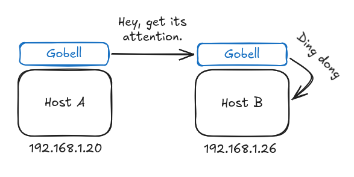

# Gobell

Gobell is a desktop application that lets you ring another computer on your LAN — no server, no internet connection required. Both machines communicate directly over the local network.

- [Gobell](#gobell)
  - [Overview](#overview)
  - [How it works](#how-it-works)
  - [Screenshots](#screenshots)
  - [Goals](#goals)
  - [Security](#security)
  - [Features](#features)
  - [Stack](#stack)
  - [Contributing](#contributing)
  - [License](#license)

---

## Overview

The idea emerged from a common office problem: you need to get a colleague's attention in another room, but they rarely notice desktop notifications. Gobell bypasses notification fatigue by sending a direct signal to their machine and triggering an unmissable alert.

## How it works

A signal is sent directly from **Host A** (sender) to **Host B** (recipient) over the LAN. No relay server sits in between. When Host B receives the signal, Gobell emits an audible alert or another hard-to-ignore cue.

## Screenshots

_Coming soon._

## Goals

Gobell aims to:

- Be simple and easy to use
- Work out of the box on any desktop OS

Gobell does not aim to:

- Be a LAN file transfer tool
- Be a LAN messaging application

## Security

- Operates on local networks only
- Both hosts must have Gobell installed and running
- Uses a dedicated custom port

## Features

- [ ] MSN-style screen shaking
- [ ] OS native notification
- [ ] Custom notification sound

## Stack

- [Go](https://go.dev)

## Contributing

Contributions are welcome. To get started:

1. Fork the repository.
2. Create a feature branch: `git checkout -b feature/your-feature`.
3. Commit your changes: `git commit -m 'Add your feature'`.
4. Push to the branch: `git push origin feature/your-feature`.
5. Open a pull request.

## License

Licensed under the [GNU General Public License v3.0](https://www.gnu.org/licenses/gpl-3.0.en.html).
Author: [Wolney Oliveira](https://www.wolney.dev)
